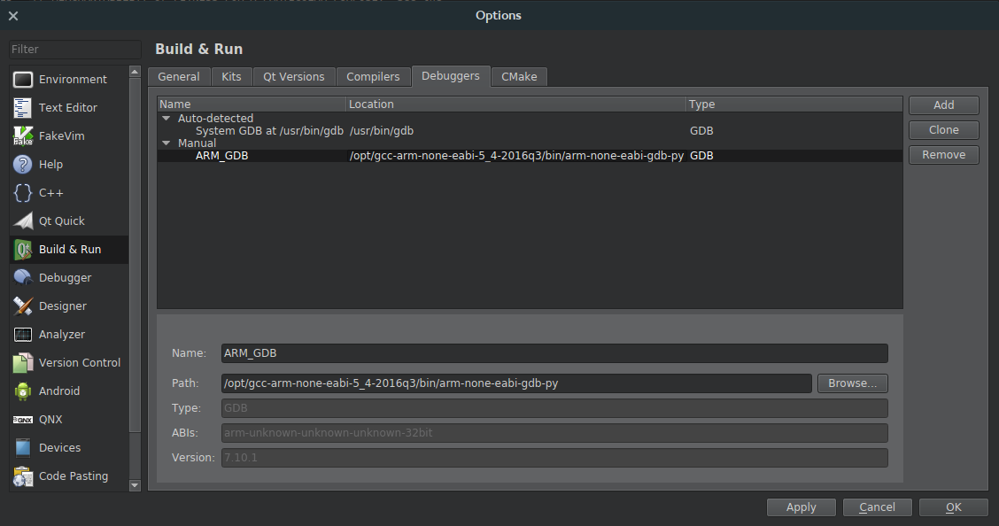
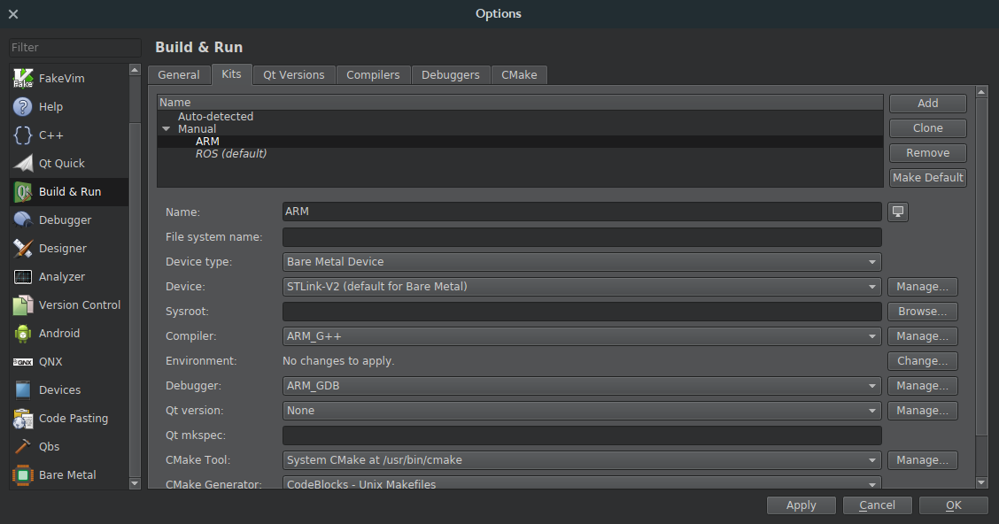
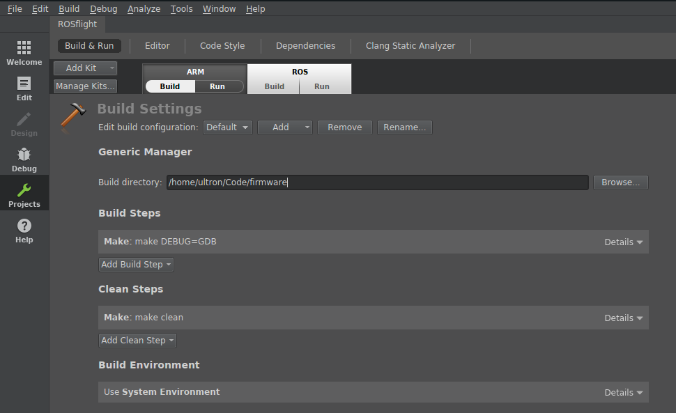

# Using an In-Circuit Debugger with a Naze32 (and variants)

Debugging a naze32 is easiest with an ST-Link V2.  You can find these on Amazon and other websites. The following guide will get you up and running with QtCreator and the in-circuit debugger.

!!! warning
    We have had reports of problems with cheap clones of ST-Links not connecting.

!!! warning
    It appears that perhaps debugging only works with Ubuntu 16.04 because of some issues with gdb-py and the "textinfo" tool in 14.04.

## Add User to Dailout Group

First, make sure you are in the `dialout` group:

``` bash
sudo adduser $USER dialout
```

Log out and back in for changes to take effect.

## Install QtCreator

For some reason, the QtCreator bundled with 16.04 is unstable. Use the most recent build of QtCreator which can be downloaded [here](https://www.qt.io/download).

This downloads a `.run` file, just make it exectuable and run as `sudo`:

```bash
cd ~/Downloads
chmod +x qt-unified-linux-x64-3.0.4-online.run 
sudo ./qt-unified-linux-x64-3.0.4-online.run 

```

If you want the icon to appear in your unity menu, create the following file as `/usr/share/applications/qtcreator.desktop` (assuming that you installed qtcreator to the Qt folder in the installer)

```
[Desktop Entry]
Exec=bash -i -c /opt/Qt/Tools/QtCreator/bin/qtcreator.sh %F
Icon=qtcreator
Type=Application
Terminal=false
Name=Qt Creator
GenericName=Integrated Development Environment
MimeType=text/x-c++src;text/x-c++hdr;text/x-xsrc;application/x-designer;application/vnd.nokia.qt.qmakeprofile;application/vnd.nokia.xml.qt.resource;
Categories=Qt;Development;IDE;
InitialPreference=9
```

## Install openocd

Open OCD (On-Chip-Debugger) is the software that will control the debugger.  We are going to install the version that is configured to work as a plugin for the eclipse IDE.  To get this version, go to the **[releases](https://github.com/gnuarmeclipse/openocd/releases)** page of the OpenOCD github page and download the latest `.tgz` file


```bash
cd ~/Downloads
tar -xvf gnuarmeclipse-openocd-debian32-0.10.0-201610281609-dev.tgz # (or whatever)
sudo mv openocd /opt/.
```

Then, for convenience, I normally create a script to run openocd for me.  Here is my `start_openocd_f1` script

``` bash
#!/bin/bash
cd /opt/openocd/0.10.0-201701241841/bin # Use the correct version
./openocd -f interface/stlink-v2.cfg -f target/stm32f1x.cfg
```

Here is my `start_openocd_f4` script

``` bash
#!/bin/bash
cd /opt/openocd/0.10.0-5-20171110-1117/bin
./openocd -f interface/stlink-v2.cfg -f target/stm32f4x.cfg
```

I move these the `~/.local/bin` directory so I can call it from anywhere:

``` bash
chmod +x start_openocd_f1
chmod +x start_openocd_f4
mv start_openocd_f1 usr/local/bin
mv start_openocd_f4 usr/local/bin
```

## Install ARM compiler and 32-bit Dependencies

Follow the guide in [Building and Flashing](/developer-guide/building-flashing.md) to install the compiler.

QtCreator also needs 32-bit python bindings to run GDB

``` bash
sudo dpkg --add-architecture i386
sudo apt-get update
sudo apt-get install libpython2.7:i386
```

## Configure QtCreator for ARM Development

Open up the new QtCreator you just installed (make sure it's the new one, and not the version you get from `apt-get`)

### Turn on the "Bare Metal Plugin"

Help -> About Plugins -> Enable "Bare Metal"

Restart QtCreator

Now, we're going to configure a new "Kit" for ARM development (this allows you to quickly switch back and forth between ARM and normal development)

### Tell QtCreator where to find the compiler (GCC)

* Tools -> Options -> Build & Run -> Compilers -> Add -> GCC -> C++.
* Name the new compiler "G++ ARM" (or something)
* Point the compiler path to where you just installed your fresh GCC.
* The path for G++ `/opt/gcc-arm-none-eabi-5_4-2016q3/bin/arm-none-eabi-g++`

Do the same for GCC (if you are going to be doing any C-only code)

* Tools -> Options -> Build & Run -> Compilers -> Add -> GCC -> C.
* Name the compiler (I named my compiler "GCC ARM)
* The path for GCC is `/opt/gcc-arm-none-eabi-5_4-2016q3/bin/arm-none-eabi-gcc`


### Add the Debugger (GDB)

* Tools -> Options -> Build & Run -> Debuggers -> Add -> GDB.
* Name it something
* Point it to the new debugger you just installed
* The Path for `/opt/gcc-arm-none-eabi-5_4-2016q3/bin/arm-none-eabi-gdb-py`



### Configure the STLink-V2 with OpenOCD

Go to the Bare Metal Plugin

* Tools -> Options -> Devices -> Bare Metal -> Add -> OpenOCD
* Leave all options at default values and click Apply

* Tools -> Options -> Devices -> Devices -> Add -> Bare Metal Device -> Start Wizard
* **Name:** ST-Link V2
* **GDB Server Provider:** OpenOCD


### Build the new Development Kit

* Tools -> Options -> Build & Run -> Kits -> Add
* Name: ARM
* Device Type: Bare Metal Device
* Device: ST-Link V2
* Compiler: GCC ARM/G++ ARM
* Debugger: ARM GDB
* Qt Version: None




## Test the Debugger

Here are the instructions for a F1 target.  The instructions are very similar for an F4, just choose the correct `.elf` file.

### Turn on Debugger

Connect the Debugger to your flight controller.  Here is the pinout for the Flip32 and flip32+


Plug in the debugger and start openocd (you'll need sudo privileges)

`sudo start_openocd_f1`

### Build the Correct Example Code

* Import Existing Project
* Open the root of the firmware
* Do _**not**_ add .creator files to the Git repository

### Configure the Build Environment

* Go to the Projects Tab on the left hand side
* Switch to the ARM Kit we just created
* Build Settings:
    * Change Build Directory to the firmware root
    * Build Steps: `make BOARD=NAZE DEBUG=GDB`

* Run Settings:
    * Change Run Configuration to hardware debugger
    * Choose the `.elf` file in the `proc/F1/build` directory (you'll need to build first) `firmware/proc/F1/build/rosflight.elf`


You're done!  Just select the Debug tab and debug your project!
