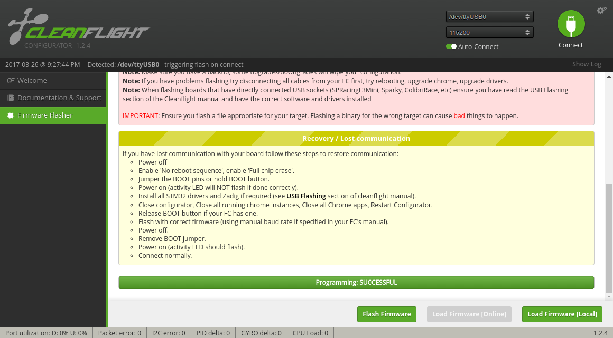

# Autopilot Setup

## Compatible hardware

As of January 2018 ROSflight is only supported on flight controllers with STM32F103 and STM32F405 processors, specifically, the revo, naze32, flip32.  Both the 6-DOF and 10-DOF versions of each board are fully supported.  We have had most success with revo boards purchased from [hobbyking](https://hobbyking.com/en_us/openpilot-cc3d-revolution-revo-32bit-flight-controller-w-integrated-433mhz-oplink.html?___store=en_us).  We have had weird issues with knock-off boards from Chinese vendors.  An acro version (IMU-Only) can be found at [readytoflyquads](https://www.readytoflyquads.com/openpilot-cc3d-revolution-acro).

## Flashing firmware using the Cleanflight Configurator

* Download the latest version of ROSflight for your board [here](https://github.com/rosflight/firmware/releases).
* Install the cleanflight configurator - It is an extension to Google Chrome - [link](https://chrome.google.com/webstore/detail/cleanflight-configurator/enacoimjcgeinfnnnpajinjgmkahmfgb?hl=en)
* Be sure your user is in the `dialout` and `plugdev` group so you have access to the serial ports. You'll need to log out and back in for these changes to take effect.
``` bash
sudo usermod -a -G plugdev <username>
sudo usermod -a -G dialout <username>
```
* Disable the modem-manager (sometimes linux thinks the device is a modem)
``` bash
sudo systemctl stop ModemManager.service
```
* Add the custom udev rule so linux handles the flight controller properly
``` bash
echo 'SUBSYSTEM=="usb", ATTRS{idVendor}=="0483", ATTRS{idProduct}=="df11", MODE="0664", GROUP="plugdev"') | sudo tee /etc/udev/rules.d/45-stdfu-permissions.rules > /dev/null
```
* Load the firmware and flash using cleanflight configurator
    * Open the configurator, open firmware flasher.  Connect your flight controller, and make sure that you have selected the right port (or DFU in the case of F4-based boards).  Then select "Load Firmware (Local)" and  select your .hex file you downloaded earlier.

    * Short the boot pins on your flight controller, unplug it, and and plug back in.
* If you scroll to the bottom of the screen, you will then see the green bar indicate progress as the hex is flashed to the flight controller.  You should then see something like the following


* You're done!  Great job.

!!! Tip
    You can completely remove the ModemManager if you don't need it, then you won't have to disable it every time you reboot.
    ```
    sudo apt-get purge modemmanager
    ```

## Flashing F4 boards from Command Line

You can also use dfu-util to flash firmware.  This is helpful if you need (or prefer) a command-line interface.

* Download and install dfu-util
``` bash
sudo apt install dfu-util
```
* Make sure you are in the dialout and plugdev group, and add the udev rule (same instructions as above)
* Short boot pins, restart the board (by unplugging and plugging back in)
* Download the latest rosflight-F4.bin file [here](https://github.com/rosflight/firmware/releases).
* Flash the firmware to the device
``` bash
    dfu-util -a 0 -s 0x08000000 -D rosflight-F4.bin
```

!!! tip
    dfu-util auto-detects F4-based boards.  Try `dfu-util` -ls to make sure your board is in bootloader mode


## Flashing F1 boards from Command Line

You can also use stm32flash to flash firmware to F1-based boards.

* Download and install stm32flash
``` bash
git clone git://git.code.sf.net/p/stm32flash/code stm32flash-code
cd stm32flash-code
sudo make install
cd ..
rm -rf stm32flash-code
```
* Make sure you are in the dialout group (same instructions as above)
* Short boot pins, restart the naze (by unplugging and plugging back in)
* Download the latest rosflight.hex file [here](https://github.com/rosflight/firmware/releases).
* Flash the firmware to the proper device (replace `/dev/ttyUSB0`)
``` bash
    stm32flash -w rosflight.hex -v -g 0x0 -b 921600 /dev/ttyUSB0
```
