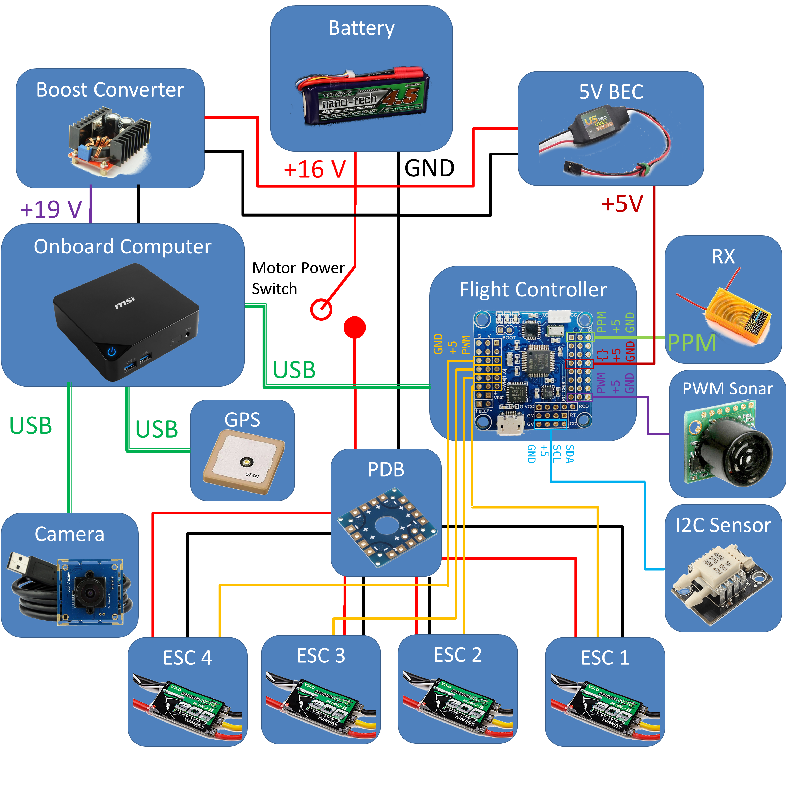
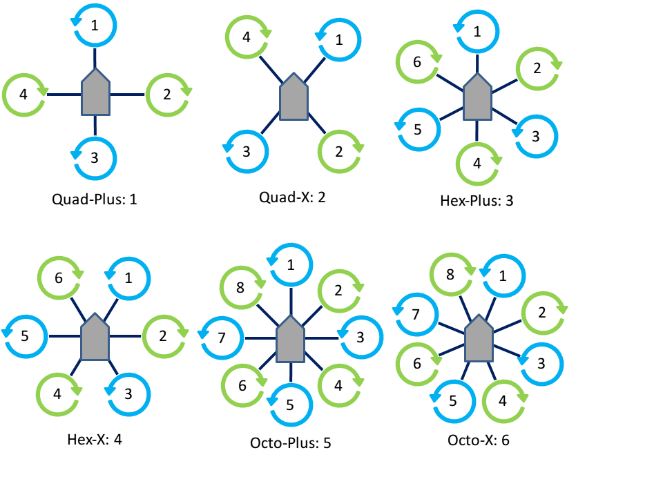
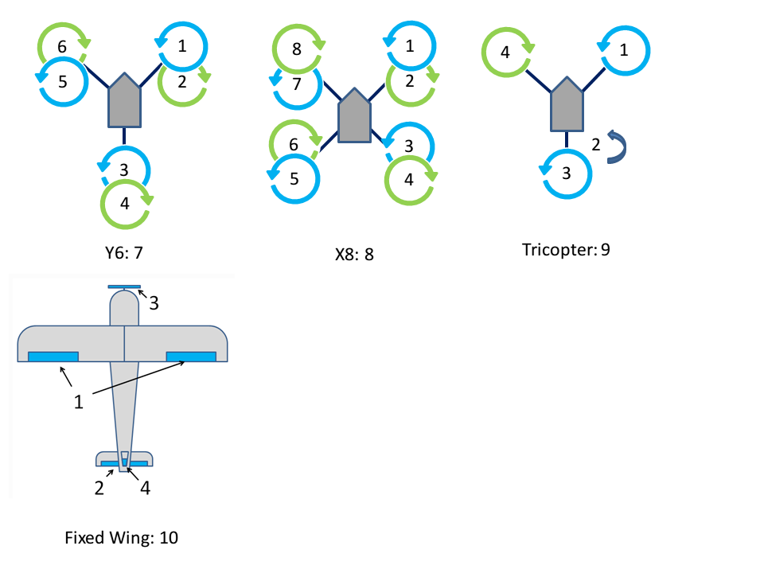

# Parts List

To use ROSflight to its full potential, you will need the following system components. Some components are mounted on your MAV (Miniature Aerial Vehicle), while others are on the ground. ROSflight supports both multirotor and fixed-wing vehicles.

*Mounted on the MAV*

1. Aircraft Frame, Motor(s), ESC(s), Battery and Propeller(s)
1. Flight Controller (FC)
1. Vibration Isolation for FC
1. Any external sensors
1. R/C Receiver
1. Companion Computer
1. Wi-Fi Antenna, or access of some kind to ground-station, wireless network (e.g. Ubiquiti Bullet)

*Ground Station*

1. Ground-Station, Wireless Network (e.g. Wi-Fi Router, Ubiquiti Rocket)
1. R/C transmitter
1. Laptop or base station computer
1. Joystick (Xbox controller)

## Frame, Motors, ESCs, Battery, and Propeller

We do not officially support any specific multirotor or airplane frame, motor, ESC, Battery or Propeller combination. There are a lot of great resources for building your own MAV, and there are a lot of great kits out there that have all of these parts.

If you are designing your own multirotor or airplane, you may want to look at [ecalc](https://www.ecalc.ch/), an online tool which can help you design a proper ESC/Battery/Motor/Propeller system for your MAV.

Some things to keep in mind as you design or build your MAV.

* Most kits do not include space for a companion computer, cameras, laser scanners or other sensors. Be sure to think about where these components are going to go, and how their placement will affect the CG of the MAV.
* You will likely also need to customize the power circuitry of your MAV to provide power to your companion computer at some specific voltage. Many people like to separate the power electronics (the ESCs and motors), from the computer and companion sensors. This can really come in handy if you are trying to develop code on the MAV, because you can have the computer on and sensors powered, and not worry at all about propellers turning on and causing injury as you move the aircraft about by hand. We will talk about this more when we talk about wiring up your MAV.
* Cheap propellers can cause a huge amount of vibration. Consider buying high-quality propellers, doing a propeller balance, or both. RCGroups, DIY Drones and Youtube have some awesome guides on how to do propeller balancing.
* ESCs will need to be calibrated from 2000 to 1000 us

## Flight Controller

ROSflight is best supported on the Openpilot Revolution from [hobbyking.com](https://hobbyking.com/en_us/openpilot-cc3d-revolution-revo-32bit-flight-controller-w-integrated-433mhz-oplink.html?___store=en_us). It works on most variants of the Revo and Naze32 flight controller. Configuring a new board is relatively straight-forward, assuming that the board uses an STM32F4xx or STM32F1xx processor.

!!! Warning
    Deprecation Notice: As of June 2019, plans are to deprecate support for the F1 in the near future. If you need to use an F1, you will need to retrieve an older version of the code that supports the F1. However, if there are issues, we will not be able to help you fix them.

!!! warning
    We have seen some problems using off-brand versions of flight controllers because the accelerometers are of very poor quality, which can mess with the firmware; try to avoid those if you can.

## External Sensors

Additional Sensors you may want for your ROSflight setup include:

* Sonar - MB1242 I2CXL-MaxSonar - [$40 on MaxBotix](https://www.maxbotix.com/Ultrasonic_Sensors/MB1242.htm)
* GPS – u-blox NEO-M8N – [$35 from Drotek](https://drotek.com/shop/en/u-blox/883-ublox-neo-m8-gps-module.html)
* Digital Airspeed Sensor – [$65 on JDrones](http://store.jdrones.com/digital_airspeed_sensor_p/senair02kit.html)

## Vibration Isolation

It is really important to isolate your flight controller from vehicle vibrations, such as those caused by propellers and motors. We recommend using small amounts of [Kyosho Zeal](https://www.amazon.com/Kyosho-Z8006-Vibration-Absorption-Sheet/dp/B002U2GS2K) to mount a fiberglass plate holding the FC to the MAV. You may also want to try adding mass to the flight control board. We have accomplished this by gluing steel washers to the fiberglass mounting plate.

You may need to experiment with the amount of gel you use, how far apart the gel is spaced, and the amount of mass added to the FC mounting plate. The interaction of these factors is difficult to predict, therefore it takes a little bit of experimentation to get it right.

## Companion Computer

The only requirement for the companion computer is that it runs Linux (Ubuntu LTS versions 16.04 or 18.04), ROS, has at least one USB port, and can be carried by the aircraft. We have had success with the following companion computers, but by no means is this a comprehensive list; it is more by way of suggestion.

* MSI CUBI – i7-5500U – [$350 on Amazon](https://www.amazon.com/MSI-Intel-Support-Barebones-Cubi-028BUS/dp/B011Q6BBMW/ref=sr_1_6?s=electronics&ie=UTF8&qid=1490068829&sr=1-6&keywords=i7+NUC)
* GIGABYTE BRIX Gaming- i7-4710HQ/GTX 760 – [$850 on Amazon](https://www.amazon.com/dp/B00OJZVGFU/ref=cm_sw_su_dp)
* Intel NUC Skullcanyon – i7-6770HQ – [$570 on Amazon](https://www.amazon.com/dp/B01DJ9XS52/ref=cm_sw_su_dp)
* ODROID-XU4 – Exynos5 2GHz 8-core – [$77 on Ameridroid](http://ameridroid.com/products/odroid-xu4)
* ODROID-C2 – Cortex A53 2GHz 4-core – [$42 on Ameridroid](http://ameridroid.com/products/odroid-c2)
* Rasberry Pi 3 – Cortex A53 1.2GHz 4-core – [$36 on Amazon](https://www.amazon.com/dp/B01CD5VC92/ref=cm_sw_su_dp)
* NVIDIA Tegra TX1 - Cortex-A57 4-core CPU, 256-core Maxwell GPU - [$435 from NVIDA](http://www.nvidia.com/object/embedded-systems-dev-kits-modules.html) (Educational Discounts Available)
* NVIDIA Tegra TX2 - 6-core ARMv8 64-bit CPU (4-core Cortex-A57, 2-core NVIDIA Denver 2), 8GB RAM, 256-core Pascal GPU - [$600 from NVIDA](https://developer.nvidia.com/embedded/buy/jetson-tx2-devkit) (Educational Discounts Available)

It is possible to pair the TX1 and TX2 with a CTI Orbitty carrier board for more compact builds.

## Wi-Fi

You will need Wi-Fi to communicate with your MAV when it is in the air. Because ROS communicates over TCP, it is very easy to use ROS to view what is going on in your MAV while it is flying by sending commands and reading sensor data. For most applications, a standard Wi-Fi router and dongle will suffice. For long-range applications, you may want to look into [Ubiquiti](https://www.ubnt.com/) point-to-point Wi-Fi. (We have seen ranges over a mile with these networks.)

## RC Transmitter and Receiver

For RC Control, you will need a transmitter with between 6 and 8 channels. Any additional channels will be wasted. We require RC control for safe operation, and only support arming and disarming via RC control.

ROSflight only supports PPM (pulse position modulation) and SBUS receivers. Individual channel PWM outputs are not supported. A common RC setup is listed here, but is meant as an example. Any configurations with PPM or SBUS and 6-8 channels will be sufficient.

* Transmitter – [FrSky Taranis QX7 ($105 on getfpv.com)](https://www.getfpv.com/frsky-taranis-q-x7-2-4ghz-16ch-transmitter-white.html)
* Receiver – [FrSky D4R-II (24.99 on getfpv.com)](https://www.getfpv.com/frsky-d4r-ii-4ch-2-4ghz-accst-receiver-w-telemetry.html)

## Laptop or Base Station Computer

You will need a laptop which can run Ubuntu 16.04 or 18.04 with ROS to communicate with the MAV over the ground station wireless network. If you are new to Linux, and want to retain access to Windows, I would recommend dual booting your computer rather than using a virtual machine. ROS networking can be problematic from a virtual environment.

## Joystick

A joystick is used for [software-in-the-loop (SIL) simulations](/user-guide/gazebo_simulation). The joystick is not technically a required component because it is possible to control your MAV from the command line, but it makes things much easier. Our first recommendation is to use the same Taranis QX7 transmitter you use for hardware as a joystick by plugging it into the computer via USB. We also support RealFlight controllers and XBOX 360 controllers. Other joysticks are supported, but you may need to perform custom axis and button mappings.

# Wiring Diagram

Below is an example wiring diagram for a multirotor using an MSI Cubi as a companion computer. This diagram also includes the motor power switch, which allows for the sensors, flight controller, and companion computer to be powered on while the motors are off. This is a safer way to test sensors, code, etc. as the motors are unable to spin while the switch is off.

Your needs will likely be slightly different than what is shown. This is meant as an example only and can be adapted to fit your needs.

# Motor Layouts

The desired mixer can be chosen by setting the `MIXER` parameter to the following values:

| # | Mixer |
|---|---------|
| 0 | ESC calibration |
| 1 | Quad + |
| 2 | Quad X |
| 3 | Hex + |
| 4 | Hex X |
| 5 | Octo + |
| 6 | Octo X |
| 7 | Y6 |
| 8 | X8 |
| 9 | Tricopter |
| 10 | Fixed-wing (traditional AETR) |

The associated motor layouts are shown below for each mixer.
The **ESC calibration** mixer directly outputs the throttle command equally to each motor, and can be used for calibrating the ESCs.

# Connecting to the Flight Controller

The flight controller communicates with the companion computer over a serial link. ROSflight only supports one serial connection at a time and by default should be the serial link connected to the USB connector on the board.

## Using secondary serial links (example: use with telemetry radio)

In the case of an F4 flight controller, which has a USB peripheral, the highest bandwidth connection will be the USB connector. However, UART3 can also be used to communicate with the companion computer if you desire a more secure connection (micro USB connectors have been known to disconnect in high vibrations), or if you would like to use a telemetry radio for remote control.

If a USB connection is detected on the USB peripheral, ROSflight will direct all communication on this port. However, if the `PARAM_SERIAL_DEVICE` parameter is set to `3` and the `PARAM_BAUD_RATE` parameter is set properly, then UART3 will be enabled when the USB connection is absent.

We have had the most sucess with the SiK radios (AKA 3DR telemetry radios). These require a 5V supply and ground and connect directly to the UART3 pins. We like the SiK radios because they can be easily configured using the `AT-commands`, which are used by [MissionPlanner](http://ardupilot.org/planner/) (Windows only), [sikset.py](https://community.emlid.com/t/sikset-py-a-python-script-to-easily-control-your-rfd900-3dr-radio-from-the-command-line/3654) or with the [AT-commands](http://files.rfdesign.com.au/Files/documents/Software%20manual.pdf) directly on the command line. There are a number of configuration options available which should be used to optimize the radios for their intended usage.

This is just an example; any UART-based communication interface should be supported through this interface.
