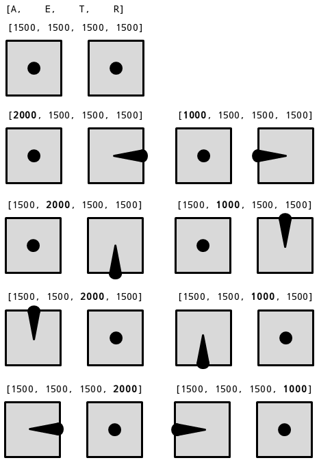

# Binding your Transmitter to your Receiver

As of version 1.0, ROSflight only supports PPM receivers on F1 controllers, while F4 controllers support SBUS and PPM. If your transmitter/receiver setup only supports PWM output, we recommend using a PPM encoder such as the one [here](https://www.getfpv.com/holybro-ppm-encoder-module.html). Be sure to set the `RC_TYPE` parameter to `0` for PPM, or `1` for SBUS.

Follow the instructions in your user manual to bind your transmitter to your RC receiver. You may also be able to find a guide on YouTube with instructions; just search for your particular transmitter and receiver model.

## RC Transmitter Calibration

To avoid confusion and to reduce code complexity in the firmware source code, ROSflight does not perform software calibration of RC transmitters. This means that RC calibration must be done on the transmitter itself, as opposed to in software. This is pretty straight-forward for most modern transmitters.

### Configure the full stick output for each channel

The easiest way to do this is to enter the "Servo Setup" Menu (for Spektrum transmitters) and change the servo travel variable.  You can watch the raw RC readings from the flight controller by echoing the rc_raw topic from `rosflight_io`

```
rostopic echo /rc_raw
```

* center both sticks on your transmitter
* Apply subtrim until the first four channels all read 1500 exactly (or as close as possible--some RC receivers are worse than others and cannot exactly output 1500 us)
* Set the channel endpoints so that maximum stick deflections result in readings of 1000 and 2000 us.

You may want to follow this YouTube guide for channel calibration in betaflight: [Calibrating RC endpoints with Taranis X9D](https://www.youtube.com/watch?v=nDsNWZgxmw4&t=186s).

### Configure stick directions for roll, pitch, and yaw channels.

You now have to make sure your RC transmitter is sending commands consistent with the north-east-down (NED) frame assumed by ROSflight.

You may find this graphic helpful.  It shows all the basic stick positions, and the associated output from the first four channels when looking at a raw AETR (aileron, elevator, throttle, rudder) RC signal from `rosflight_io`.  Make sure that the stick output is in the correct direction.



It should be noted that channel assignment can be modified via the `RC_*_CHN` parameters.  So, if you are using something other than AETR assignment, the channel index for each stick may be different, but the direction should be the same.

# Switch configuration

Switches can be configured for the following functions.
To disable a switch for a specific, default function, set the corresponding parameter to `-1`.
Be sure to check that the switch directions operate as you intend, and reverse them in your transmitter if necessary.

## Safety pilot configuration

The `RC_ATT_OVRD_CHN` parameter maps a switch to override attitude commands with RC control.
The `RC_THR_OVRD_CHN` parameter maps a switch to override throttle commands with RC control.
To override both with a single switch, set both parameters to the same value (this is the default behavior).

## Arming

By default, arming is done with the sticks (left stick down and right to arm, down and left to disarm).
To use a switch instead, set the `ARM_CHANNEL` parameter to the desired channel.
Setting an arming switch disables arming with the sticks.

## Flight mode

If desired, you can map a switch to select between attitude control types (angle and rate) in flight by setting the `RC_ATT_CTRL_CHN` parameter to the desired channel.
This can be useful if, for example, you are learning rate mode but want to be able to switch back to attitude mode to help stabilize the vehicle.
This feature is disabled by default.
